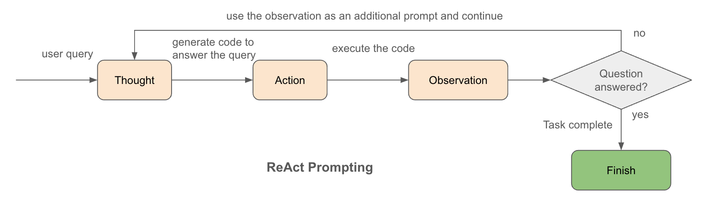

# Building a Q&A LLM Agent to Answer Questions about Your Dataset

This repo provides 1) a step-by-step guide on using [ReAct prompting](https://arxiv.org/abs/2210.03629) with the Google `gemini-2.0-flash` model to build a Q&A LLM agent for answering questions about your dataset in notebook and 2) deployment of the LLM in Hugging Face.

Here are the key steps:

1. **Set up**: Set up your environment and load your dataset
2. **ReAct prompt**: Define a ReAct prompt containing model instructions, table schema, and few-shot examples to guide the model's reasoning.
3. **ReAct agent**: Create a ReAct agent using the ReAct class, which encapsulates the interaction with the Gemini model.
4.  **Ask questions**: Interact with the agent by asking questions about your dataset. The agent will use its tools (search, execute, finish) to find answers.
5. **Deployment**: Deploy the LLM into web using Mesop

## Background and Motivation

Part of data scientists' work often involves answering ad-hoc questions from stakeholders. These questions can range from simple data lookups to complex queries requiring aggregation and filtering.

This colab introduces a way to address this challenge: a ReAct-based Q&A LLM agent specifically designed to answer questions about your dataset. [**ReAct**](https://arxiv.org/abs/2210.03629) is a prompting technique that enables language models to document their reasoning process when answering questions. This is achieved by generating a series of Thought, Action, and Observation steps, which improves transparency and makes the model's responses easier to understand and trust. By leveraging the power of Large Language Models (LLMs) and the ReAct prompting technique, this agent can automate the process of understanding and responding to ad-hoc data inquiries.

**Motivation**: The primary motivation behind this tool is to empower DS and stakeholders by streamlining the process of accessing and understanding data insights to reduce ad-hoc request burden and empower stakeholders with self-service analytics

## Steps to Build a LLM Q&A Agent
Please follow the [notebook](build_a_qa_llm_agent.ipynb)

## Deployment
I use Mesop to build AI apps in python (see [Mesop](https://mesop-dev.github.io/mesop/)), and deployed it in HuggingFace, see [Demo](https://huggingface.co/spaces/haoyuanzhang/qa_agent), the codes for the demo are in the **deployment folder**, whcih includes the prompt and the ReAct pipeline.

